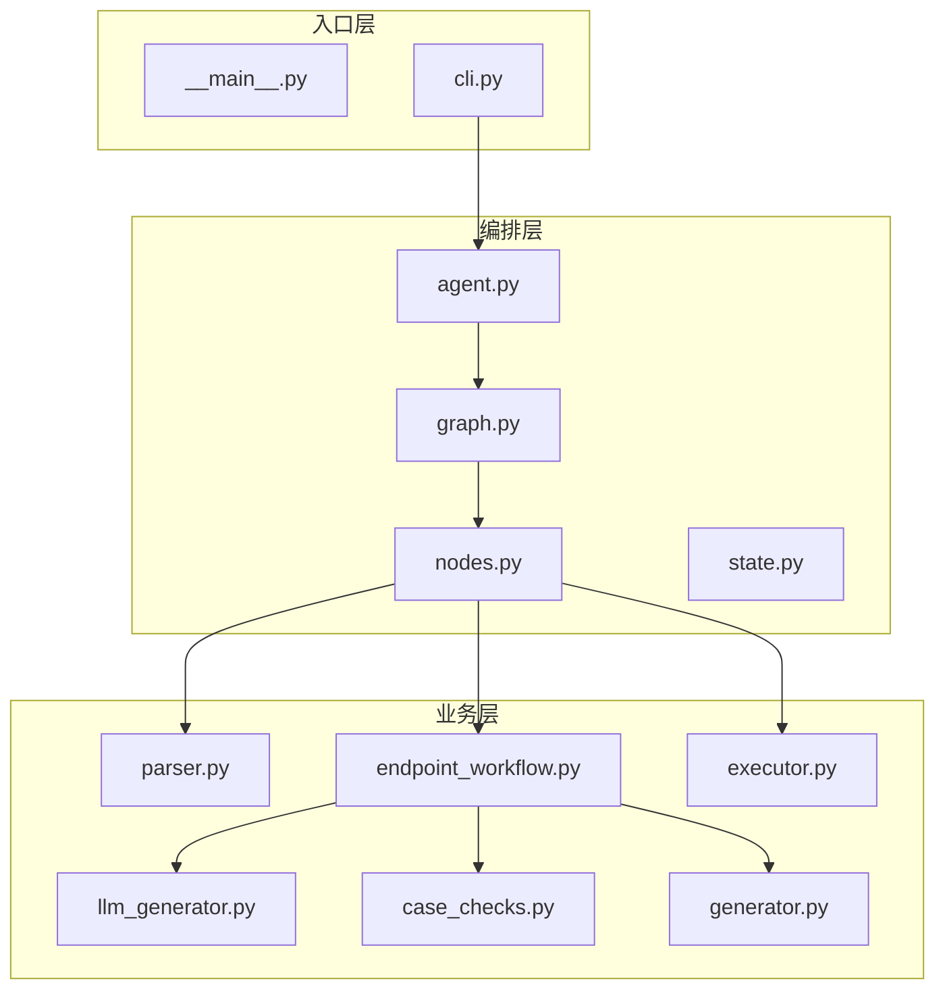
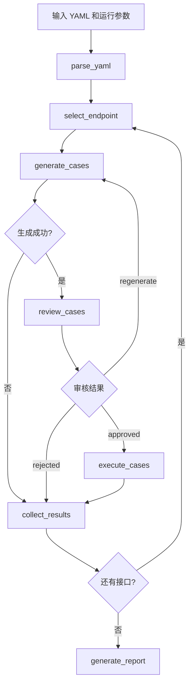

# Apiauto-Agent 代码审阅与实现说明

> 依据仓库当前代码整理  
> 更新时间：2026-03-18

## 1. 审阅结论

当前仓库的主实现已经收敛到一条明确主线：

1. 解析 OpenAPI / Swagger YAML
2. 逐接口调用 LLM 生成测试用例
3. 对生成结果做最小有效性检查
4. 可选人工审核，并支持将反馈回传给 LLM 重生成
5. 执行测试用例
6. 汇总测试报告

完整执行入口只有一个：

- `ApiTestAgent.run_graph()`

辅助入口只有一个：

- `ApiTestAgent.generate_only()`

不存在以下旧逻辑：

- 顺序模式完整执行入口 `run()`
- `fallback_rule_gen`
- `check_cases` 图节点
- `--use-graph` 开关

## 2. 当前实现架构



## 3. 核心流程



## 4. 模块职责

### 4.1 `agent.py`

- 定义 `EndpointReport` 和 `TestReport`
- 提供 `generate_only()`
- 提供 `run_graph()`
- 将 graph 输出的 dict 还原为 `TestReport`

### 4.2 `graph.py`

- 只定义图拓扑
- 不承载业务细节
- 条件边包括：
  - `should_execute_current_endpoint`
  - `route_after_review`
  - `has_more_endpoints`

### 4.3 `nodes.py`

- 负责图节点和状态间转换
- dataclass 和 dict 互转
- 调用业务层和执行层

### 4.4 `endpoint_workflow.py`

- `generate_validated_cases()`
  - 调用 LLM 生成
  - 调用 `case_checks.validate_generated_cases()` 校验
- `review_generated_cases()`
  - 处理人工审核通过 / 反馈 / 拒绝
- `summarize_case_counts()`
  - 统计正常 / 异常用例数

### 4.5 `llm_generator.py`

- 负责 prompt 构造
- 通过 OpenAI 兼容接口调用 LLM
- 支持人工反馈再次生成
- 失败时抛 `CaseGenerationError`

### 4.6 `executor.py`

- `MockExecutor`
  - 正常用例返回 200
  - 异常用例按 `expected_status` 视为通过
- `ApiExecutor`
  - 构造 `ReportGenerateRequest` 风格请求
  - 向 `/report/generatAutotestReport` 发起同步请求

## 5. 当前实现的正确性边界

### 5.1 已经闭合的部分

- LLM 失败会显式标记为接口级失败
- 生成失败不会进入伪成功报告
- 人工审核可以把问题回传给 LLM
- Java `TestReportController` 已改为同步返回，不再走回调

### 5.2 当前仍然存在的限制

1. 图模式没有独立的“解析失败”终止分支  
   `parse_yaml()` 节点会返回 `error` 和空 `endpoints`，但图本身仍然会继续进入 `select_endpoint`。这意味着无效 YAML 的图模式闭环还不完整。

2. `ApiExecutor` 还没有请求渲染层  
   当前只是：
   - `url = target_base_url + endpoint_path`
   - `header = headers JSON`
   - `param = [parameters JSON]`  
   还没有把 `path/query/header/body` 做严格拆分。

3. `ApiExecutor` 的成功判定仍然偏宽  
   当前使用：
   - `success = resp.status_code < 500`  
   这更接近“请求已送达接口A”，不是“测试语义已验证正确”。

4. `generate_only()` 不包含人工审核和执行  
   它只是：
   - 解析 YAML
   - 调用 `generate_validated_cases()`
   - 返回 `list[TestCase]`

## 6. 外部接口说明

### 6.1 LLM 接口

要求为 OpenAI 兼容 `chat/completions` 接口。

关键请求字段：

- `model`
- `messages`
- `temperature`

关键响应字段：

- `choices[0].message.content`

### 6.2 接口A执行接口

Python `api` 模式发送的请求结构：

```json
{
  "url": "http://target-host/pets",
  "header": "{\"Content-Type\":\"application/json\"}",
  "param": ["{\"limit\":10}"],
  "uuid": "task-id",
  "env": "dev"
}
```

### 6.3 Java `TestReportController`

当前仓库中的 Java 文件已经是同步模式：

- `POST /report/generatAutotestReport`
- 接收 `ReportGenerateRequest`
- 调用 `testReportApplication.generatReport(url, header, param).get()`
- 成功直接 `return new Result().ok(result)`
- 失败直接抛异常

不再存在：

- 异步回调通知
- 回调地址选择
- “测试报告生成中”的占位响应

## 7. 建议优先级

1. 给 `ApiExecutor` 增加请求渲染层，明确拆分 `path/query/header/body`
2. 给图模式补上 YAML 解析失败的终止分支
3. 收紧 `api` 模式的成功判定，不再只看 HTTP 状态码
