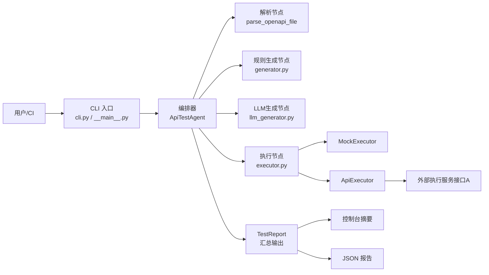
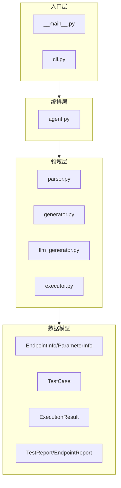
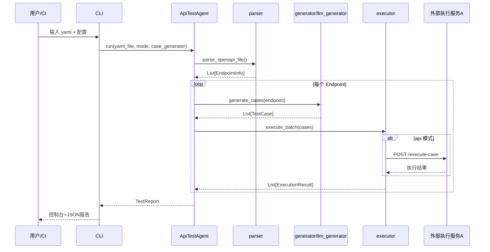

# Apiauto-agent 代码审阅与详细设计文档

## 1. 项目审阅结论

本项目当前实现了一个清晰的三段式流水线：
1. `parser.py` 负责解析 OpenAPI/Swagger YAML 为统一的 `EndpointInfo`/`ParameterInfo`。
2. `generator.py`（规则）与 `llm_generator.py`（LLM）负责生成测试参数与用例。
3. `executor.py` 将用例传入 mock 或外部 API 执行，`agent.py` 聚合报告。

从设计完整性看，项目已经具备你描述的核心闭环：**读取 YAML → 生成参数/用例 → 调用执行接口 → 输出报告**。

---

## 2. 架构图

### 2.1 系统上下文架构图

### 2.2 逻辑分层图

---

## 3. 节点设计

### 3.1 入口节点（CLI）
- **职责**：接收 YAML 路径、执行模式（mock/api）、生成策略（rule/llm）等参数。
- **输入**：命令行参数。
- **输出**：初始化后的 `ApiTestAgent` 与运行参数。
- **失败策略**：参数缺失时由 argparse/显式校验抛错。

### 3.2 编排节点（ApiTestAgent）
- **职责**：串联解析、过滤、用例生成、执行、报告聚合。
- **关键路径**：
  - `run()`：完整执行。
  - `generate_only()`：仅生成不执行。
  - `_generate_cases()`：根据 `rule/llm` 策略路由，LLM失败自动降级 rule。
- **输出契约**：统一输出 `TestReport`。

### 3.3 解析节点（Parser）
- **职责**：统一 OpenAPI 3.x 与 Swagger 2.0 结构差异。
- **关键能力**：
  - `$ref` 递归解析。
  - `allOf` 合并。
  - 参数约束抽取（minimum/maximum/enum/maxLength 等）。
- **输出**：`list[EndpointInfo]`。

### 3.4 用例生成节点（Rule Generator）
- **职责**：基于参数约束生成正常/异常测试集。
- **正常集**：必填参数、全参数、枚举值、数值边界。
- **异常集**：缺参、类型错误、空值、越界、超长、格式错误、注入、无参数。
- **输出**：`list[TestCase]`。

### 3.5 LLM 生成节点（LLMCaseGenerator）
- **职责**：将接口描述序列化为 prompt，通过 OpenAI 兼容接口生成 JSON 用例。
- **鲁棒性设计**：
  - 支持 markdown code block 与纯 JSON 两种响应解析。
  - 捕获网络/JSON/字段错误，失败时返回空列表供上层降级。

### 3.6 执行节点（Executor）
- **MockExecutor**：本地模拟执行，支持快速回归。
- **ApiExecutor**：将 `TestCase` POST 到外部接口A执行。
- **输出**：`ExecutionResult` 列表，统一 success/status_code/耗时。

### 3.7 报告节点（Report）
- **职责**：按接口维度与全局维度汇总通过率、失败数、明细。
- **输出格式**：
  - 文本摘要（`summary()`）
  - 结构化字典（`to_dict()`），便于落盘 JSON 与上游系统消费。

---

## 4. 数据流

### 4.1 端到端数据流图

### 4.2 数据对象演进

`YAML文件` → `EndpointInfo[]` → `TestCase[]` → `ExecutionResult[]` → `TestReport`

---

## 5. GitHub 相似 Agent 项目调研（受网络访问限制的离线结论）

> 说明：当前运行环境无法访问 GitHub（`curl https://github.com` 返回 403），以下是基于通用开源生态的离线对标清单，建议你在线二次核验 star/活跃度。

### 5.1 高相似方向项目

1. **schemathesis/schemathesis**
   - 方向：基于 OpenAPI 的自动化 API 测试与 fuzz。
   - 相似点：从 API schema 自动生成请求与测试。
   - 差异点：偏 property-based/fuzz，不以内置 LLM 生成为核心。

2. **dreddjs/dredd**
   - 方向：依据 API 描述文档进行契约测试。
   - 相似点：以 OpenAPI/Swagger 为输入驱动测试执行。
   - 差异点：偏契约验证，不强调智能参数构造与 Agent 编排。

3. **EvoMaster (WebFuzzing/EvoMaster)**
   - 方向：自动化生成 REST API 测试数据与序列。
   - 相似点：自动生成测试输入并执行。
   - 差异点：搜索/进化算法为主，不是 LLM-first agent。

4. **Portman (apideck-libraries/portman)**
   - 方向：OpenAPI -> Postman collection + 测试。
   - 相似点：从 API 定义自动构造测试。
   - 差异点：目标运行时是 Postman/Newman 生态。

### 5.2 “LLM + API 测试 Agent”定位差异

你的项目相对上述工具的独特定位在于：
- 将 **LLM 用例生成** 与 **规则生成降级** 组合，提升可用性。
- 保持执行层抽象（Mock/API 双执行器），便于逐步接入企业内部“接口A”。
- 报告模型简单直接，利于 CI 集成。

---

## 6. 现状优势与改进建议

### 6.1 优势
- 模块边界清晰（解析/生成/执行/编排）。
- 数据结构统一（dataclass），可维护性好。
- LLM失败自动降级，提高系统稳定性。

### 6.2 建议优先级
1. **高优先级**：执行结果判定从“`status < 500`即成功”升级为“与`expected_status`匹配区间/集合”。
2. **高优先级**：参数位置分发（query/path/header/body）与请求构造应分层，避免全部扁平进 `parameters`。
3. **中优先级**：增加重试、幂等键、trace_id，便于对接真实执行平台。
4. **中优先级**：报告增加失败分类（参数校验失败/服务异常/网络异常）和 TopN 风险接口。
5. **中优先级**：为 LLM 输出增加 JSON Schema 校验，减少脏数据进入执行层。

---

## 7. 推荐演进架构（面向生产）

- **新增 Plan 节点**：先做接口风险评分（鉴权/金额/写操作），再控制生成策略与并发。
- **新增 Memory 节点**：缓存“接口历史失败模式”，用于下一轮提示增强。
- **新增 Guardrail 节点**：对高风险 payload（注入/超大包）做执行前审计。
- **新增 Replay 节点**：失败用例自动二次回放，区分偶发失败与稳定失败。

该演进可将当前“线性流水线”升级为“可学习闭环 Agent”。
