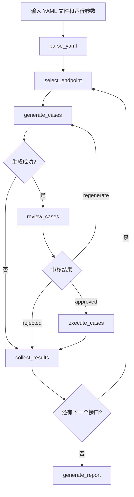
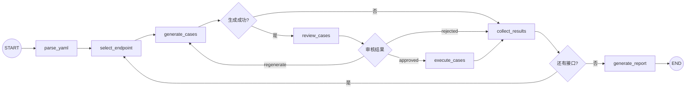

# Apiauto-Agent 详细设计文档

> 依据当前仓库实现整理  
> 更新时间：2026-03-18

## 1. 目标与范围

本项目当前只围绕一条核心能力设计：

1. 读取 OpenAPI / Swagger YAML
2. 为接口生成测试用例
3. 允许人工审核生成结果
4. 执行测试用例
5. 输出测试报告

本文档不描述已删除的历史方案，只描述当前代码实际提供的能力。

## 2. 运行方式

当前存在两个入口：

### 2.1 完整执行入口

- `ApiTestAgent.run_graph()`
- CLI 默认调用 `run_graph()`

### 2.2 仅生成入口

- `ApiTestAgent.generate_only()`
- CLI 在 `--generate-only` 时调用

## 3. 核心业务流程

### 3.1 完整流程图



### 3.2 流程说明

| 阶段 | 输入 | 处理 | 输出 |
|------|------|------|------|
| 解析 YAML | `yaml_file` | 提取接口、参数、约束 | `endpoints` |
| 选择接口 | `current_index` | 选中当前接口 | `current_endpoint` |
| 生成用例 | `current_endpoint` | LLM 生成并校验 | `current_cases` |
| 人工审核 | `current_cases` | 通过 / 反馈 / 拒绝 | `review_status` |
| 执行用例 | `current_cases` | Mock 或接口A执行 | `current_results` |
| 汇总接口结果 | `current_results` | 形成接口级报告 | `endpoint_reports` |
| 汇总全局结果 | `endpoint_reports` | 形成最终报告 | `report` |

## 4. LangGraph 设计

### 4.1 图结构



### 4.2 节点职责

| 节点 | 实际职责 |
|------|----------|
| `parse_yaml` | 调用 `parse_openapi_file()`，得到接口列表 |
| `select_endpoint` | 取当前索引对应接口 |
| `generate_cases` | 创建 `LLMCaseGenerator`，调用业务层生成并校验 |
| `review_cases` | 调用业务层处理人工审核 |
| `execute_cases` | 创建执行器并批量执行用例 |
| `collect_results` | 统计当前接口结果，推进索引，清理审核状态 |
| `generate_report` | 汇总所有接口报告 |

### 4.3 条件边职责

| 条件函数 | 作用 |
|----------|------|
| `should_execute_current_endpoint` | 生成失败时直接跳过审核和执行 |
| `route_after_review` | 审核通过执行，反馈回生成，拒绝则结束当前接口 |
| `has_more_endpoints` | 决定继续下一个接口还是输出最终报告 |

### 4.4 状态对象

核心状态定义在 `state.py`，重要字段包括：

- 输入参数：
  - `yaml_file`
  - `mode`
  - `api_url`
  - `endpoint_filter`
  - `case_type`
  - `human_review`
  - `llm_api_url`
  - `uuid`
  - `env`
  - `target_base_url`
  - `target_headers`
- 流程状态：
  - `endpoints`
  - `current_index`
  - `current_endpoint`
  - `current_cases`
  - `generation_failed`
  - `generation_error`
  - `review_feedback`
  - `review_status`
  - `review_round`
  - `max_review_rounds`
- 输出：
  - `current_results`
  - `endpoint_reports`
  - `report`

## 5. 模块设计

### 5.1 入口层

#### `__main__.py`

- 支持 `python -m apiauto_agent`
- 直接调用 `cli.main()`

#### `cli.py`

- 解析命令行参数
- 校验 YAML 文件存在
- 解析 `target_headers`
- 创建 `ApiTestAgent`
- 决定调用：
  - `generate_only()`
  - `run_graph()`

当前 CLI 不存在 `--use-graph`，图模式就是默认完整执行路径。

### 5.2 编排层

#### `agent.py`

定义：

- `EndpointReport`
- `TestReport`
- `ApiTestAgent`

`ApiTestAgent` 只保留两个公开方法：

- `generate_only()`
- `run_graph()`

#### `graph.py`

- 只负责编排图
- 节点实现不写在这里

#### `nodes.py`

- dataclass 与 dict 互转
- 负责图节点函数
- 负责图条件路由函数

### 5.3 业务层

#### `parser.py`

- 支持 OpenAPI 3.x
- 支持 Swagger 2.0
- 支持 `$ref` 解析
- 支持 `allOf` 合并
- 抽取参数约束和 `requestBody`

#### `llm_generator.py`

- 构建系统提示词和用户提示词
- 调用 OpenAI 兼容接口
- 支持人工审核反馈二次生成
- 支持重试
- 失败时抛 `CaseGenerationError`

#### `case_checks.py`

生成结果的最小有效性检查包括：

- 至少存在 1 条用例
- `case_type` 必须合法
- `endpoint_path` 必须与接口一致
- `method` 必须与接口一致
- `parameters` 必须是对象
- `headers` 必须是对象
- `expected_status` 如存在必须是整数

#### `endpoint_workflow.py`

这是图外的单接口业务层，负责：

- `generate_validated_cases()`
- `review_generated_cases()`
- `summarize_case_counts()`

图模式调用它，图本身不重复实现这些业务细节。

#### `executor.py`

提供：

- `MockExecutor`
- `ApiExecutor`
- `create_executor()`

其中 `ApiExecutor` 会把 `TestCase` 转成接口A接收的结构：

```json
{
  "url": "http://target-host/pets",
  "header": "{\"Content-Type\":\"application/json\"}",
  "param": ["{\"page\":1}"],
  "uuid": "task-id",
  "env": "dev"
}
```

## 6. 人工审核设计

### 6.1 触发方式

CLI 传入：

- `--human-review`

### 6.2 审核动作

人工审核有三种结果：

- `a`：通过
- `f`：反馈修改
- `r`：拒绝

### 6.3 回环规则

- `approved` -> 进入 `execute_cases`
- `regenerate` -> 带 `review_feedback` 回到 `generate_cases`
- `rejected` -> 当前接口直接记为生成失败并汇总

### 6.4 边界保护

- 反馈不能为空
- `review_round` 达到 `max_review_rounds` 后，直接按失败处理

## 7. 对外接口说明

### 7.1 CLI 接口

命令：

```bash
python -m apiauto_agent <yaml_file> [options]
```

关键参数：

| 参数 | 作用 |
|------|------|
| `yaml_file` | OpenAPI / Swagger YAML 文件路径 |
| `--llm-api-url` | LLM 接口地址，必填 |
| `--llm-api-key` | LLM API Key |
| `--llm-model` | LLM 模型名 |
| `--mode` | `mock` / `api` |
| `--api-url` | 接口A地址 |
| `--case-type` | `all` / `normal` / `abnormal` |
| `--generate-only` | 只生成不执行 |
| `--human-review` | 启用人工审核 |
| `--target-base-url` | 被测接口基础地址 |
| `--target-headers` | 被测接口固定请求头 |
| `--uuid` | 任务标识 |
| `--env` | 环境标识 |

### 7.2 Python 接口

#### `ApiTestAgent.generate_only()`

作用：

- 解析 YAML
- 调用 LLM 生成并校验用例
- 返回 `list[TestCase]`

#### `ApiTestAgent.run_graph()`

作用：

- 构建初始状态
- 调用 `build_graph()`
- 运行完整图流程
- 返回 `TestReport`

### 7.3 LLM 接口

要求为 OpenAI 兼容 `chat/completions` 接口。

### 7.4 接口A执行接口

默认调用：

- `POST /report/generatAutotestReport`

Python 侧传递字段：

- `url`
- `header`
- `param`
- `uuid`
- `env`

### 7.5 Java 控制器

仓库中的 `TestReportController.java` 当前行为：

- 接收 `ReportGenerateRequest`
- 同步执行 `generatReport(...).get()`
- 成功直接返回 `Result.ok(result)`
- 不再使用回调

## 8. 测试与验证

当前仓库有：

- `tests/test_agent.py`
- `tests/test_graph.py`
- `tests/test_llm_generator.py`

已覆盖的重点包括：

- `run_graph()` 端到端 mock 流程
- 生成失败和校验失败的失败落报告
- 人工审核反馈回环
- `generate_only()` 行为
- LLM prompt 与解析逻辑

## 9. 当前实现的限制

1. 图模式没有单独的 YAML 解析失败终止分支
2. `ApiExecutor` 还没有独立的请求渲染层
3. `ApiExecutor` 成功判定仍是 `status_code < 500`
4. `requestBody` 仍然只取第一个 `content-type`

这些是当前代码的真实边界，不在文档里做超前承诺。
