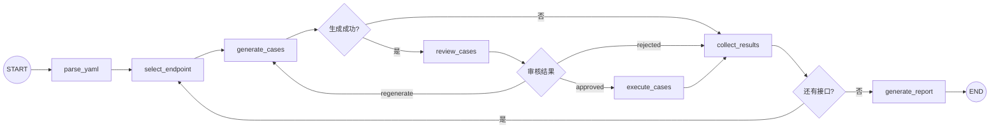

# Apiauto-Agent LangGraph 设计说明

> 依据当前仓库实现整理  
> 更新时间：2026-03-18

## 1. 设计原则

当前项目中，LangGraph 只负责：

1. 编排节点顺序
2. 表达条件路由
3. 表达人机回环

LangGraph 不负责：

- 解析业务规则
- 用例校验细节
- 人工审核具体交互逻辑
- 执行器内部请求组装

这些能力已经下沉到业务层模块。

## 2. 当前图拓扑

## 3. 节点说明

### 3.1 `parse_yaml`

- 输入：`yaml_file`, `endpoint_filter`
- 输出：`endpoints`, `current_index`, `endpoint_reports`

### 3.2 `select_endpoint`

- 输入：`endpoints`, `current_index`
- 输出：`current_endpoint`

### 3.3 `generate_cases`

- 创建 `LLMCaseGenerator`
- 调用 `endpoint_workflow.generate_validated_cases()`
- 输出：
  - `current_cases`
  - `generation_failed`
  - `generation_error`
  - `generation_method`

### 3.4 `review_cases`

- 调用 `endpoint_workflow.review_generated_cases()`
- 输出：
  - `review_status`
  - `review_feedback`
  - 必要时设置失败状态

### 3.5 `execute_cases`

- 创建执行器
- 调用 `execute_batch()`
- 输出：`current_results`

### 3.6 `collect_results`

- 汇总当前接口报告
- 重置审核状态
- `current_index + 1`

### 3.7 `generate_report`

- 汇总所有接口报告
- 生成最终 `report`

## 4. 条件边说明

### 4.1 `should_execute_current_endpoint`

- 如果 `generation_failed=True`
  - 返回 `collect_results`
- 否则
  - 返回 `review_cases`

### 4.2 `route_after_review`

- `approved` -> `execute_cases`
- `regenerate` -> `generate_cases`
- `rejected` -> `collect_results`

### 4.3 `has_more_endpoints`

- 还有接口 -> `select_endpoint`
- 没有接口 -> `generate_report`

## 5. 状态字段

关键状态字段：

- 输入参数：
  - `yaml_file`
  - `mode`
  - `api_url`
  - `case_type`
  - `human_review`
  - `llm_api_url`
  - `uuid`
  - `env`
  - `target_base_url`
  - `target_headers`
- 当前接口状态：
  - `current_endpoint`
  - `current_cases`
  - `generation_failed`
  - `generation_error`
  - `review_feedback`
  - `review_status`
  - `review_round`
- 全局输出：
  - `current_results`
  - `endpoint_reports`
  - `report`

## 6. 当前实现中不存在的旧设计

下列设计已经不在当前代码中：

- `fallback_rule_gen`
- `check_generation`
- `check_cases`
- `run()`
- `--use-graph`
- “图模式和传统模式并存”的运行方式

## 7. 与非图逻辑的关系

图模式不调用一个“顺序完整执行方法”，因为这个方法已经删除。

当前关系是：

- 图负责完整编排
- `generate_only()` 负责仅生成
- 业务逻辑由图节点调用以下模块完成：
  - `endpoint_workflow.py`
  - `case_checks.py`
  - `llm_generator.py`
  - `executor.py`

## 8. 当前局限

1. 没有单独的解析失败终止边
2. 没有请求渲染层来区分 `path/query/body/header`
3. `api` 模式成功判定仍偏宽

这些限制在当前文档中被明确保留，不做超前承诺。
