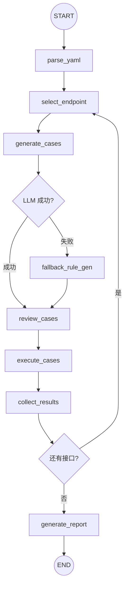

# Apiauto-Agent LangGraph 重构详细设计

> 版本：v0.2.0 | 日期：2026-03-17

---

## 1. 概述

### 1.1 背景

项目 v0.1.0 采用线性函数调用实现 `YAML 解析 → 用例生成 → 测试执行 → 报告输出` 流水线。虽然功能完备，但缺乏：

- 显式的状态管理与可观测性
- 条件路由（LLM 降级逻辑耦合在业务代码中）
- 断点续跑（长任务中断后无法恢复）
- 人机交互（用例审核需二次开发）

### 1.2 目标

引入 [LangGraph](https://github.com/langchain-ai/langgraph) 框架，将编排层重构为 **StateGraph**，实现：

1. 将流水线建模为有状态图，每个阶段是独立节点
2. 条件边实现 LLM 降级和循环控制
3. 保持与传统模式的向后兼容（`--use-graph` 开关）
4. 为未来 checkpoint、human-in-the-loop、并行执行奠定基础

### 1.3 参考项目

| 项目 | 方向 | 参考价值 |
|------|------|----------|
| [langchain-ai/langgraph](https://github.com/langchain-ai/langgraph) | LangGraph 核心框架 | StateGraph API、条件边、checkpoint |
| [codefuse-ai/Test-Agent](https://github.com/codefuse-ai/Test-Agent) | LLM 驱动测试智能体 | 测试领域 Agent 架构 |
| [schemathesis](https://github.com/schemathesis/schemathesis) | OpenAPI 自动化测试 | 用例生成策略 |
| [EvoMaster](https://github.com/WebFuzzing/EvoMaster) | REST API 测试生成 | 进化算法 + 测试自动化 |
| [Portman](https://github.com/apideck-libraries/portman) | OpenAPI → Postman 测试 | API 定义驱动测试 |

---

## 2. 图架构设计

### 2.1 Graph 拓扑



### 2.2 数据流

```
YAML文件 ──parse_yaml──▶ list[EndpointInfo]
                             │
                    ┌──select_endpoint──(循环)
                    │        │
                    │   EndpointInfo
                    │        │
                    │  generate_cases ──▶ list[TestCase]
                    │        │                │
                    │   check_generation      │
                    │    ╱        ╲           │
                    │  成功      失败         │
                    │   │    fallback_rule_gen│
                    │   │         │           │
                    │   review_cases          │
                    │        │                │
                    │   execute_cases ──▶ list[ExecutionResult]
                    │        │
                    │   collect_results ──▶ EndpointReport
                    │        │
                    └──has_more_endpoints
                             │
                    generate_report ──▶ TestReport
```

---

## 3. State Schema

```python
class ApiTestState(TypedDict, total=False):
    # 输入参数
    yaml_file: str
    mode: Literal["mock", "api"]
    case_generator: Literal["rule", "llm"]
    api_url: str
    timeout: int
    headers: dict[str, str]
    endpoint_filter: str
    case_type: Literal["all", "normal", "abnormal"]
    human_review: bool

    # LLM 配置
    llm_api_url: str
    llm_api_key: str
    llm_model: str

    # 流程状态
    endpoints: list[dict]          # EndpointInfo 序列化后的 dict 列表
    current_index: int             # 当前处理的接口索引
    current_endpoint: dict         # 当前接口
    current_cases: list[dict]      # 当前接口的 TestCase 列表
    generation_method: str         # "llm" / "rule" / "rule_fallback"
    generation_failed: bool        # LLM 是否失败

    # 执行结果
    current_results: list[dict]    # 当前接口的执行结果
    endpoint_reports: list[dict]   # 所有接口的报告

    # 最终输出
    report: dict                   # 最终 TestReport
    error: str                     # 错误信息
```

**设计决策**：所有 dataclass（EndpointInfo、TestCase 等）在存入 State 时转为 dict，在节点内部还原。这保证了 LangGraph 的序列化兼容性。

---

## 4. 节点详细设计

### 4.1 `parse_yaml` — 解析 YAML

| 项目 | 说明 |
|------|------|
| 复用模块 | `parser.parse_openapi_file()` |
| 输入 | `state.yaml_file`, `state.endpoint_filter` |
| 输出 | `endpoints`, `current_index=0`, `endpoint_reports=[]` |
| 错误处理 | 文件不存在或格式错误时设置 `state.error` |

### 4.2 `select_endpoint` — 选取当前接口

| 项目 | 说明 |
|------|------|
| 逻辑 | `current_endpoint = endpoints[current_index]` |
| 输出 | `current_endpoint` |

### 4.3 `generate_cases` — 生成测试用例

| 项目 | 说明 |
|------|------|
| 复用模块 | `llm_generator.LLMCaseGenerator` / `generator.*` |
| LLM 模式 | 调用 LLM API，成功则返回用例；失败则标记 `generation_failed=True` |
| 规则模式 | 直接调用规则引擎 |
| 输出 | `current_cases`, `generation_failed`, `generation_method` |

### 4.4 `fallback_rule_gen` — 降级规则生成

| 项目 | 说明 |
|------|------|
| 触发条件 | `check_generation` 条件边检测到 `generation_failed=True` |
| 复用模块 | `generator.*` |
| 输出 | `current_cases`, `generation_method="rule_fallback"` |

### 4.5 `review_cases` — 用例审核

| 项目 | 说明 |
|------|------|
| 当前行为 | 直接通过（日志记录） |
| 未来扩展 | 接入 LangGraph `interrupt` 机制实现人工审核 |

### 4.6 `execute_cases` — 执行测试用例

| 项目 | 说明 |
|------|------|
| 复用模块 | `executor.create_executor()` + `execute_batch()` |
| 输出 | `current_results` |

### 4.7 `collect_results` — 汇总结果

| 项目 | 说明 |
|------|------|
| 逻辑 | 统计通过/失败数，构建 EndpointReport，推进 `current_index` |
| 输出 | `endpoint_reports` (追加), `current_index += 1` |

### 4.8 `generate_report` — 生成最终报告

| 项目 | 说明 |
|------|------|
| 逻辑 | 汇总所有 EndpointReport，计算通过率 |
| 输出 | `report` |

---

## 5. 条件边

### 5.1 `check_generation` — LLM 降级路由

```python
def check_generation(state) -> Literal["review_cases", "fallback_rule_gen"]:
    if state.get("generation_failed"):
        return "fallback_rule_gen"
    return "review_cases"
```

### 5.2 `has_more_endpoints` — 循环控制

```python
def has_more_endpoints(state) -> Literal["select_endpoint", "generate_report"]:
    if state["current_index"] < len(state["endpoints"]):
        return "select_endpoint"
    return "generate_report"
```

---

## 6. 文件结构

```
apiauto_agent/
├── __init__.py
├── __main__.py
├── cli.py              # 新增 --use-graph, --human-review 参数
├── agent.py            # 新增 run_graph() 方法
├── parser.py           # 不变
├── generator.py        # 不变
├── llm_generator.py    # 不变
├── executor.py         # 不变
├── state.py            # 新增：State Schema 定义
├── nodes.py            # 新增：节点实现函数
└── graph.py            # 新增：LangGraph StateGraph 组装

tests/
├── test_agent.py       # 不变（11 个原有测试）
├── test_llm_generator.py # 不变（4 个原有测试）
└── test_graph.py       # 新增（23 个 LangGraph 测试）
```

---

## 7. 使用方式

### 7.1 CLI

```bash
# 传统模式（默认，向后兼容）
python -m apiauto_agent examples/petstore.yaml

# LangGraph 模式
python -m apiauto_agent examples/petstore.yaml --use-graph

# LangGraph + LLM 生成
python -m apiauto_agent examples/petstore.yaml --use-graph \
    --case-generator llm --llm-api-url http://localhost:8000/v1/chat/completions

# 输出 JSON 报告
python -m apiauto_agent examples/petstore.yaml --use-graph --output report.json
```

### 7.2 Python API

```python
from apiauto_agent.agent import ApiTestAgent

agent = ApiTestAgent(mode="mock")

# 传统模式
report = agent.run("examples/petstore.yaml")

# LangGraph 模式
report = agent.run_graph("examples/petstore.yaml")

print(report.summary())
```

### 7.3 直接使用 Graph

```python
from apiauto_agent.graph import build_graph
from apiauto_agent.state import create_initial_state

state = create_initial_state(yaml_file="examples/petstore.yaml", mode="mock")
graph = build_graph()
result = graph.invoke(state)
print(result["report"])
```

---

## 8. 测试矩阵

| 测试类别 | 数量 | 说明 |
|----------|------|------|
| 图编译 | 2 | 编译、Mermaid 输出 |
| 端到端（Mock） | 5 | 全量/正常/异常/过滤/序列化 |
| 结果一致性 | 1 | Graph 模式 vs 传统模式统计对比 |
| 节点单元 | 10 | 每个节点独立测试 |
| 条件边 | 4 | 各条件分支覆盖 |
| LLM 降级 | 1 | 端到端降级验证 |
| **合计** | **23** | |

---

## 9. 依赖变更

```diff
# requirements.txt
  pyyaml>=6.0
  requests>=2.28.0
+ langgraph>=0.2.0
+ langchain-core>=0.3.0
```

---

## 10. 未来演进路线

### Phase 1（当前）— 基础 Graph 重构
- [x] StateGraph 建模
- [x] 8 个节点 + 2 个条件边
- [x] CLI `--use-graph` 开关
- [x] 23 个测试全部通过

### Phase 2 — Checkpoint & 断点续跑
- [ ] 接入 `SqliteSaver` 或 `MemorySaver`
- [ ] 支持长任务中断后恢复

### Phase 3 — Human-in-the-loop
- [ ] `review_cases` 节点接入 `interrupt` 机制
- [ ] Web UI 或 CLI 交互式审核

### Phase 4 — 并行执行
- [ ] 使用 LangGraph `Send` API 并行处理多接口
- [ ] 异步 executor 提升吞吐

### Phase 5 — 智能增强
- [ ] Memory 节点：缓存历史失败模式
- [ ] Plan 节点：接口风险评分 → 优先级排序
- [ ] Guardrail 节点：高风险 payload 审计
- [ ] Replay 节点：失败用例自动回放
